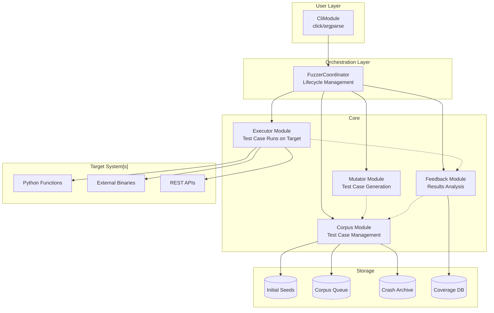

```mermaid
graph TB
    subgraph "User Layer"
        CLI[CliModule<br/>click/argparse]
    end
    
    subgraph "Orchestration Layer"
        Coord[FuzzerCoordinator<br/>Lifecycle Management]
    end
    
    subgraph "Core"
        Corpus[Corpus Module<br/>Test Case Management]
        Mutator[Mutator Module<br/>Test Case Generation]
        Exec[Executor Module<br/>Test Case Runs on Target]
        Feedback[Feedback Module<br/>Results Analysis]
    end
    
    subgraph "Storage"
        Seeds[(Initial Seeds)]
        Queue[(Corpus Queue)]
        Crashes[(Crash Archive)]
        CoverageDB[(Coverage DB)]
    end
    
    subgraph "Target System[s]"
        PythonFunc[Python Functions]
        Binary[External Binaries]
        RESTAPI[REST APIs]
    end
    
    CLI --> Coord
    
    Coord --> Corpus
    Coord --> Mutator
    Coord --> Exec
    Coord --> Feedback
    
    Corpus --> Seeds
    Corpus --> Queue
    Corpus --> Crashes
    
    Feedback --> CoverageDB
    
    Exec --> PythonFunc
    Exec --> Binary
    Exec --> RESTAPI
    
    Mutator -.-> Corpus
    Exec -.-> Feedback
    Feedback -.-> Corpus
```