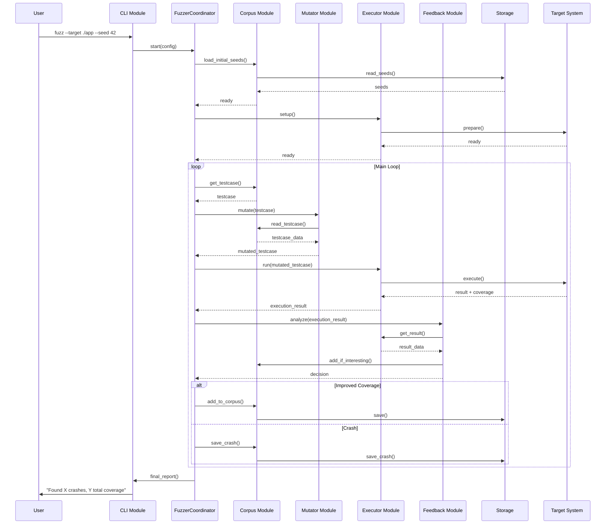

```mermaid
sequenceDiagram
    participant User as User
    participant CLI as CLI Module
    participant Coord as FuzzerCoordinator
    participant Corpus as Corpus Module
    participant Mutator as Mutator Module
    participant Exec as Executor Module
    participant Feedback as Feedback Module
    participant Storage as Storage
    participant Target as Target System
    
    User->>CLI: fuzz --target ./app --seed 42
    CLI->>Coord: start(config)
    
    Coord->>Corpus: load_initial_seeds()
    Corpus->>Storage: read_seeds()
    Storage-->>Corpus: seeds
    Corpus-->>Coord: ready
    
    Coord->>Exec: setup()
    Exec->>Target: prepare()
    Target-->>Exec: ready
    Exec-->>Coord: ready
    
    loop Main Loop
        Coord->>Corpus: get_testcase()
        Corpus-->>Coord: testcase
        
        Coord->>Mutator: mutate(testcase)
        Mutator->>Corpus: read_testcase()
        Corpus-->>Mutator: testcase_data
        Mutator-->>Coord: mutated_testcase
        
        Coord->>Exec: run(mutated_testcase)
        Exec->>Target: execute()
        Target-->>Exec: result + coverage
        Exec-->>Coord: execution_result
        
        Coord->>Feedback: analyze(execution_result)
        Feedback->>Exec: get_result()
        Exec-->>Feedback: result_data
        Feedback->>Corpus: add_if_interesting()
        Feedback-->>Coord: decision
        
        alt Improved Coverage
            Coord->>Corpus: add_to_corpus()
            Corpus->>Storage: save()
        else Crash
            Coord->>Corpus: save_crash()
            Corpus->>Storage: save_crash()
        end
    end
    
    Coord->>CLI: final_report()
    CLI->>User: "Found X crashes, Y total coverage"
```