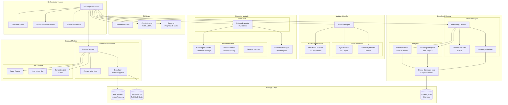

```mermaid
graph TB
    subgraph "CLI Layer"
        CLIParser[Command Parser]
        ConfigLoader[Config Loader<br/>YAML/JSON]
        Reporter[Reporter<br/>Progress & Stats]
    end
    
    subgraph "Orchestration Layer"
        Coordinator[Fuzzing Coordinator]
        Timer[Execution Timer]
        StopCondition[Stop Condition Checker]
        StatsCollector[Statistics Collector]
    end
    
    subgraph "Corpus Module"
        subgraph "Corpus Components"
            CorpusStorage[Corpus Storage]
            Minimizer[Corpus Minimizer]
            Serializer[Serializer<br/>pickle/msgpack]
        end
        
        subgraph "Corpus Data"
            SeedQueue[Seed Queue]
            InterestingSet[Interesting Set]
            FavoritesList[Favorites List<br/>in AFL]
        end
    end
    
    subgraph "Mutator Module"
        subgraph "Base Mutators"
            ByteMutator[Byte Mutator<br/>AFL-style]
            DictMutator[Dictionary Mutator<br/>Tokens]
        end
        
        subgraph "Advanced Mutators"
            StructMutator[Structured Mutator<br/>JSON/Protobuf]
        end
        
        MutatorSelector[Mutator Adapter]
    end
    
    subgraph "Executor Module"
        subgraph "Executors"
            PythonExec[Python Executor<br/>in-process]
        end
        
        subgraph "Instrumentation"
            CoverageCollector[Coverage Collector<br/>SanitizerCoverage]
            TraceCollector[Trace Collector<br/>Branch tracing]
            TimeoutHandler[Timeout Handler]
        end
        
        ResourceManager[Resource Manager<br/>Process pool]
    end
    
    subgraph "Feedback Module"
        subgraph "Analyzers"
            CoverageAnalyzer[Coverage Analyzer<br/>New edges?]
            CrashAnalyzer[Crash Analyzer<br/>Unique crash?]
        end
        
        subgraph "Decision Logic"
            InterestingDecider[Interesting Decider]
            PowerCalculator[Power Calculator<br/>in AFL]
            CoverageUpdater[Coverage Updater]
        end
        
        GlobalState[Global Coverage Map<br/>Edge hit counts]
    end
    
    subgraph "Storage Layer"
        FileStorage[(File System<br/>corpus/crashes/)]
        MetadataDB[(Metadata DB<br/>PgSQL/SQLite)]
        CoverageDB[(Coverage DB<br/>Bitmaps)]
    end
    
    Coordinator --> CLIParser 
    Coordinator --> ConfigLoader 
    Coordinator --> Timer
    Coordinator --> StopCondition
    Coordinator --> StatsCollector
    Coordinator --> Reporter
    
    Coordinator --> CorpusStorage
    Coordinator --> MutatorSelector
    Coordinator --> PythonExec
    Coordinator --> InterestingDecider
    
    CorpusStorage --> SeedQueue
    CorpusStorage --> InterestingSet
    CorpusStorage --> FavoritesList
    CorpusStorage --> Serializer
    CorpusStorage --> Minimizer
    
    MutatorSelector --> ByteMutator
    MutatorSelector --> DictMutator
    MutatorSelector --> StructMutator
    
    PythonExec --> ResourceManager
    
    PythonExec --> CoverageCollector
    
    InterestingDecider --> CoverageAnalyzer
    InterestingDecider --> CrashAnalyzer
    CrashAnalyzer --> GlobalState
    CoverageAnalyzer --> GlobalState
    
    InterestingDecider --> PowerCalculator
    InterestingDecider --> CoverageUpdater
    
    Serializer --> FileStorage
    Serializer --> MetadataDB
    CoverageUpdater --> GlobalState
    GlobalState --> CoverageDB
```